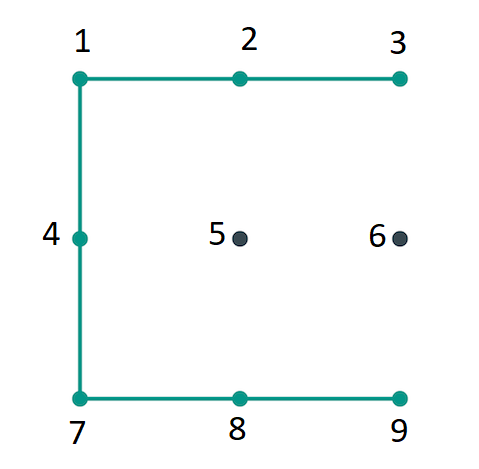

# Android Pattern Lock Decoder

Pattern unlock on Android is entered by joining at least four points on a 3x3 matrix. Each point can only be used once and the maximum number of points is nine. Android, internally stores the pattern as a byte sequence. Each point is mapped to its index, where 0 represents the top left point and 8 the bottom right one on the matrix. Thus the pattern is similar
to a PIN Lock with a minimum of four and and a maximum of nine digits but which only use nine distinctive digits (0 to 8). Because points cannot be repeated in the pattern and certain combinations are not possible (e.g. directly connecting 1 to 9), the number of variations in an unlock pattern is considerably lower compared to those of a nine-digit PIN.

The Sha-1 hash of a pattern lock is stored in 
```
/data/system/gesture.key

/data/systems/users/<user-id>/gesture.key (on multi-user devices)
```
as an **unsalted** SHA-1 value.

Each pattern is always hashed to the same value because a random salt value isn't used when calculating the hash. This makes it relatively easy to generate a precomputed table of all possible patterns and their respective hashes. This allows for **instant** recovery of the pattern once the `gesture.key` file is retrieved from the device. However the file,
is owned by the system user and its default permissions are set to `0600` so on production devices recovery is not possible without rooting the device.

## Usage

```bash
Usage: python3 androidpatterndecode.py -g <gesture.key> -d <dictionary file containing sha1 hashs>.
This program is used to recover android's pattern passowrd.

Options:
  -h, --help            show this help message and exit
  -g GESTURE_FILE, --gesture=GESTURE_FILE
                        Path to your gesture.key file in your local system
  -d DICTIONARY_FILE, --dictionary=DICTIONARY_FILE
                        Path to your dictionary file containing sha1 hashes in
                        your local system
```

## Example

Example below uses the following pattern lock:



Copy the gesture.key file from `/data/system/gesture.key` to `/sdcard/` and pull the file from the device using `adb pull /sdcard/gesture.key .`

To view the content use the `od` dump tool or any hex editor like `ghex or HxD or xxd` (Example file in [res/gesture.key](./res/gesture.key))

```
$ od -t x1 < res/gesture.key 
0000000    21  69  de  4f  e6  5b  c2  46  78  0d  72  6a  e1  c2  5c  5b
0000020    fc  51  5a  5d                                                
0000024
```

To lookup the pattern use the [androidpatterendecode.py](./androidpatterendecode.py) python script with the provided hash table:

```bash
$ python3 androidpatterndecode.py -g res/gesture.key -d res/androidpatternsha1.txt
[+] Pattern retrieved from gesture.key file is: 3214789
```
